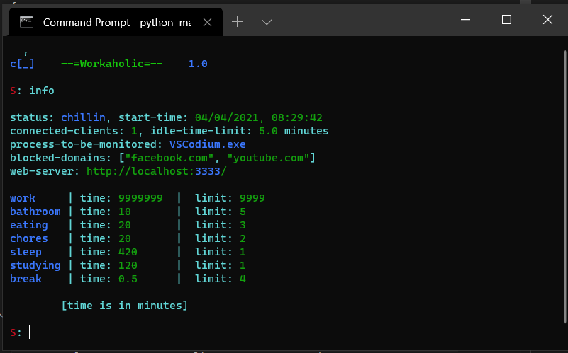

# workaholic
time manager that shouts at you when you are not doing your work

  

> this project only supports windows at the moment



## Features
- process monitoring
- time tracking
- chrome extension
- website blocking
- shouting (yes)

## Config
the config file is in `chrome-extension/config.json`

```json
{
  "host": "localhost",
  "port": 3333,
  "blocked_domains": [
    "facebook.com",
    "youtube.com"
  ],
  "breaks": {
    "work": {"minutes": 9999999, "limit": 9999},
    "bathroom": {"minutes": 10, "limit": 5},
    "eating": {"minutes": 20, "limit": 3},
    "chores": {"minutes": 20, "limit": 2},
    "sleep": {"minutes": 420, "limit": 1},
    "studying": {"minutes": 120, "limit": 1},
    "break": {"minutes": 10, "limit": 4}
  },
  "version": 1.0,
  "process": "VSCodium.exe",
  "idle_limit": 300
}
```

## Adding Chrome Extension 
you need to add the chrome-extension to your browser for the website blocking to work
1. go to - [chrome://extensions/](chrome://extensions/)
2. enable developer mode
3. load unpacked
4. select `workaholic/chrome-extension`

## Installing Requirements
```
$: pip install -r requirements.txt
```

## Commands
| CMD      | Description |
| ----------- | ----------- |
| help      | show help message       |
| clients   | see connected browser extensions        |
| clear   | clear the screen |
| set   | change current status  |
| info  | show stored states  |
| exit  | exit the program  |
> do `info` to see the list of statuses which you can use

## Shout Triggers
things that will cause `workaholic` to shout at you
- not getting back on time
- opening blocked-domains during work
- closing the monitored process during work
- being idle more than the `idle_time` limit

## Audio Files
the audio files are located in the `audio/` directory and mapped out in `data.py`, any necessary audio related changes in should be done there.